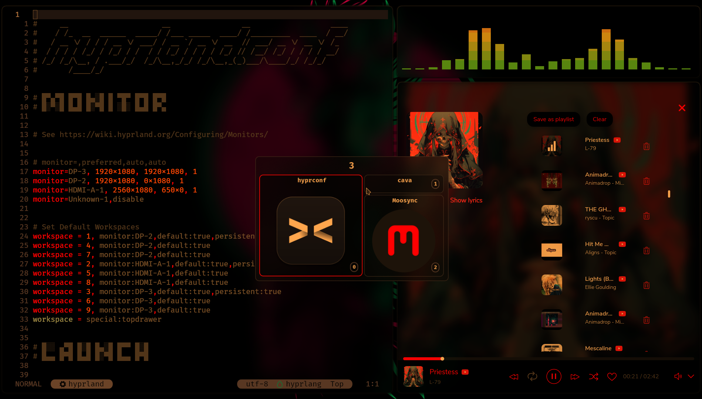

# sunsetr

Automatic blue light filter for Hyprland, Niri, and everything Wayland



## Features

- **Multi-Compositor Support**: Works with Hyprland, Niri, Sway, River, Wayfire, and other Wayland compositors
- **Smarter hyprsunset Management**: Add longer, cleaner, and more precise sunset/sunrise transitions to hyprsunset (Hyprland)
- **Smooth Startup Transitions**: Configurable fade-in effect during startup
- **Geolocation-based Transitions**: Automatic sunrise/sunset calculation based on your location
- **Interactive City Selection**: Choose from 10,000+ cities worldwide for precise coordinates
- **Automatic Timezone Detection**: Falls back to system timezone for location approximation
- **Universal Wayland Support**: Direct protocol communication on Wayland compositors
- **Smart Defaults**: Works beautifully out-of-the-box with carefully tuned settings
- **Flexible Configuration**: Extensive customization options for power users

## Dependencies

### For Hyprland Users

- **Hyprland >=0.49.0**
- **hyprsunset >=v0.2.0**

### For Other Wayland Compositors

- **Any Wayland compositor** supporting `wlr-gamma-control-unstable-v1` protocol
- **No external dependencies** - uses native Wayland protocols

## 📥 Installation

### Option 1: Build from Source

```bash
git clone https://github.com/psi4j/sunsetr.git
cd sunsetr
cargo build --release
sudo cp target/release/sunsetr /usr/local/bin/
```

### Option 2: AUR (Arch Linux)

You can find [sunsetr-bin](https://aur.archlinux.org/sunsetr-bin.git) in the AUR and can install it using your favorite AUR helper:

```bash
paru -S sunsetr-bin
```

## Recommended Setup

### Hyprland

For the smoothest experience on Hyprland, add this line near the **beginning** of your `hyprland.conf`:

```bash
exec-once = sunsetr
```

This ensures sunsetr starts early during compositor initialization, providing seamless color temperature management from the moment your desktop loads.

⚠️ **WARNING:**

- **Do not use with hyprsunset's native config**: I recommend removing `hyprsunset.conf` entirely or backing it up. (sunsetr will need full control for smooth transition times)
- **Make sure hyprsunset isn't already running** if you want this to work with `start_hyprsunset = true` from the default config. You can check that a hyprsunset process isn't already running using btop or an alternative method.
- I recommend you **disable hyprsunset's systemd service** using `systemctl --user disable hyprsunset.service` and make sure to stop the process before running sunsetr.

### niri

For the smoothest experience on niri, add this line near the **beginning** of your startup config in `config.kdl`:

```kdl
spawn-at-startup "sunsetr"
```

### Other Wayland compositors

If you're running on Sway, or any other alternatives, see their recommended startup methods for background applications. If you run into any trouble and need any help feel free to open up an issue or start a discussion.

## Alternative Setup: Systemd Service

If you prefer systemd management:

```bash
systemctl --user enable --now sunsetr.service
```

## 🌍 Geographic Location Setup

sunsetr can automatically calculate sunrise and sunset times based on your geographic location using the `transition_mode = "geo"` setting. This provides more accurate and natural transitions than fixed times.

### Interactive City Selection

For the most precise location setup, use the interactive city selector:

```bash
sunsetr --geo
```

This launches an interactive fuzzy search interface where you can:

- Type to search from 10,000+ cities worldwide
- Navigate with arrow keys (↑/↓)
- Select with Enter, cancel with Esc
- Search by city name or country

The tool will show you calculated sunrise/sunset times and save the coordinates to your configuration.

### Automatic Location Detection

If you don't manually select a city, sunsetr automatically detects your approximate location using:

1. **System timezone detection** - Multiple fallback methods for robust detection
2. **Timezone-to-coordinates mapping** - 466 timezone mappings worldwide
3. **London fallback** - If timezone detection fails (just run `sunsetr --geo`)

### Location-Based Transition Details

When using `transition_mode = "geo"`:

- **Enhanced twilight calculations**: Uses +10° to -2° sun elevation angles for longer, more natural transitions
- **Timezone precision**: Automatically determines correct local timezone for coordinates
- **Extreme latitude support**: Special handling for polar regions with seasonal adjustments
- **Real-time calculation**: Transitions automatically adjust throughout the year

### Geographic Debug Information

To see detailed solar calculation information for your location:

```bash
sunsetr --debug
```

This shows:

- Detected/configured coordinates and timezone
- Precise sunset/sunrise timing with transition boundaries
- Calculation method used (standard or extreme latitude fallback)

To see more details when you choose your location with the city selector:

```bash
sunsetr --geo --debug
```

### Testing other city's coordinates (not your current location)

I realize we might want to test other cities' sunset/sunrise times and transition durations. Maybe we have to fly to another timezone for a special event and we want to get ahead of the jet lag and fix our sleeping schedule to their timezone.

Just run `sunsetr --geo`. If you run this with `--debug`, you'll see an additional set of times in brackets `[]` to the right of the primary set of times. These times are in your autodetected local timezone. The primary set of times correspond to the selected city's coordinates' sunset/sunrise transition times. Ex:

```
[LOG] Solar calculation details:
┃           Raw coordinates: 35.6895°, 139.6917°
┃               Sunrise UTC: 19:25
┃                Sunset UTC: 10:00
┃       Coordinate Timezone: Asia/Tokyo (+09:00)
┃            Local timezone: America/Chicago (-05:00)
┃     Current time (Coords): 12:41:47
┃      Current time (Local): 22:41:47
┃           Time difference: +14 hours
┃   --- Sunset (descending) ---
┃   Transition start (+10°): 18:10:16 [04:10:16]
┃   Golden hour start (+6°): 18:30:20 [04:30:20]
┃               Sunset (0°): 19:00:26 [05:00:26]
┃      Transition end (-2°): 19:10:28 [05:10:28]
┃          Civil dusk (-6°): 19:30:32 [05:30:32]
┃            Night duration: 9 hours 5 minutes
┃   --- Sunrise (ascending) ---
┃          Civil dawn (-6°): 03:55:43 [13:55:43]
┃    Transition start (-2°): 04:15:47 [14:15:47]
┃              Sunrise (0°): 04:25:50 [14:25:50]
┃     Golden hour end (+6°): 04:55:57 [14:55:57]
┃     Transition end (+10°): 05:16:01 [15:16:01]
┃              Day duration: 12 hours 54 minutes
┃           Sunset duration: 60 minutes
┃          Sunrise duration: 60 minutes
┃
[LOG] Next transition will begin at: 18:10:15 [04:10:15] Day 󰖨  → Sunset 󰖛
```

### Using Arbitrary Coordinates

If the city selector (`sunsetr --geo`) is not as precise as you'd like, you're welcome manually add coordinates to `sunsetr.toml`. I recommend using https://www.geonames.org/ or Google Earth to find your coordinates. North is positive, South is negative. East is positive, West is negative.

```toml
#[Geolocation-based transitions]
latitude = 29.424122   # just switch these up
longitude = -98.493629 # `sunsetr --debug` to see the times/duration
```

### Privacy-Focused Geographic Configuration

If you version control your configuration files (e.g., in a dotfiles repository), you may not want to expose your geographic location. sunsetr supports storing coordinates in a separate `geo.toml` file that you can keep private:

1. **Create the geo.toml file** in the same directory as your sunsetr.toml:

   ```bash
   touch ~/.config/sunsetr/geo.toml
   ```

2. **Add geo.toml to your .gitignore**:

   ```bash
   echo "geo.toml" >> ~/.gitignore
   ```

3. **Run `sunsetr --geo`** to populate it (or enter manual coordinates)

4. **Delete or spoof coordinates in** `sunsetr.toml`

Once `geo.toml` exists, it will:

- Override any coordinates in your main `sunsetr.toml`
- Receive all coordinate updates when you run `sunsetr --geo`
- Keep your location private while allowing you to version control all other settings

Example `geo.toml`:

```toml
#[Private geo coordinates]
latitude = 40.7128
longitude = -74.0060
```

This separation allows you to share your sunsetr configuration publicly without accidentally doxxing yourself. `geo.toml` can also serve as a temporary place to store your coordinates when travelling.

## ⚙️ Configuration

sunsetr creates a default configuration at `~/.config/sunsetr/sunsetr.toml` on first run (legacy location `~/.config/hypr/sunsetr.toml` is still supported). The defaults provide an excellent out-of-the-box experience for most users:

```toml
#[Sunsetr configuration]
backend = "auto"                # Backend to use: "auto", "hyprland" or "wayland"
start_hyprsunset = true         # Set true if you're not using hyprsunset.service
startup_transition = true       # Enable smooth transition when sunsetr starts
startup_transition_duration = 1 # Duration of startup transition in seconds (1-60)
night_temp = 3300               # Color temperature after sunset (1000-20000) Kelvin
day_temp = 6500                 # Color temperature during day (1000-20000) Kelvin
night_gamma = 90                # Gamma percentage for night (0-100%)
day_gamma = 100                 # Gamma percentage for day (0-100%)
update_interval = 60            # Update frequency during transitions in seconds (10-300)
transition_mode = "geo"         # Select: "geo", "finish_by", "start_at", "center"

#[Manual transitions]
sunset = "19:00:00"             # Time to transition to night mode (HH:MM:SS) - ignored in geo mode
sunrise = "06:00:00"            # Time to transition to day mode (HH:MM:SS) - ignored in geo mode
transition_duration = 45        # Transition duration in minutes (5-120)

#[Geolocation-based transitions]
latitude = 29.424122            # Geographic latitude (auto-detected on first run)
longitude = -98.493629          # Geographic longitude (use 'sunsetr --geo' to change)
```

### Key Settings Explained

- **`backend = "auto"`** (recommended): Automatically detects your compositor and uses the appropriate backend. Use auto if you plan on using sunsetr on both Hyprland and other Wayland compositors like niri or Sway.
- **`start_hyprsunset = true`** (Hyprland only): sunsetr automatically starts and manages hyprsunset. This setting will not start hyprsunset on any non-Hyprland Wayland compositor and will be ignored. Keep this set to true and choose `auto` as your backend if you want to run sunsetr as a controller for hyprsunset on Hyprland and also plan to use other Wayland compositors. I switch between niri and Hyprland and this is the setting I use.
- **`startup_transition = true`**: Provides smooth animated transitions from current display values to target values when sunsetr starts. The duration is configurable via `startup_transition_duration` (1-60 seconds). This creates a pleasant fade effect instead of an abrupt change. (**Note:** This feature is only available on the Wayland backend. Hyprland users will experience hyprsunset's built-in non-configurable startup transition instead, as hyprsunset v0.2.0+ currently forces its own startup transitions that cannot be disabled.)
- **`transition_mode = "geo"`** (default): Automatically calculates sunset/sunrise times based on your geographic location. Use `sunsetr --geo` to select your city or let it auto-detect from your timezone. This provides the most natural transitions that change throughout the year.
- **Other transition modes**: `"finish_by"` ensures transitions complete exactly at configured times, `"start_at"` begins transitions at configured times, `"center"` centers transitions around configured times.

### Backend-Specific Configuration

#### Automatic Detection (Recommended)

```toml
backend = "auto"
```

sunsetr will automatically detect your compositor and configure itself appropriately.

#### Explicit Backend Selection

```toml
# For Hyprland users
backend = "hyprland"
start_hyprsunset = true

# For other Wayland compositors (Though it works on Hyprland too)
backend = "wayland"
# Ignored on non-Hyprland compositors when backend is set to auto
start_hyprsunset = false
```

## Alternative Configurations

### Using External hyprsunset Management

While **not recommended** due to added complexity, you can manage hyprsunset separately. Set this to false in `sunsetr.toml`:

```toml
start_hyprsunset = false
```

Then start hyprsunset via systemd:

```bash
systemctl --user enable --now hyprsunset.service
```

Or in `hyprland.conf`:

```bash
exec-once = hyprsunset
```

**Note**: I haven't extensively tested external hyprsunset management and recommend the default integrated approach for the smoothest experience.

### Smooth Startup Transition

For smooth startup transitions that ease in to the configured temperature and gamma values:

```toml
startup_transition = true
startup_transition_duration = 1 # Second(s)
```

**NOTE** Hyprwm decided to give hyprsunset its own non-optional startup transitions that conflict with ours, so these settings are ignored when using the Hyprland backend. You can still use these setting in Hyprland by switching to the Wayland backend and disabling `start_hyprsunset`.

## 🔄 Live Configuration Reload

You can reload sunsetr's configuration without restarting:

```bash
sunsetr --reload
```

This command:

- Sends a signal to the running sunsetr instance to reload its configuration
- Preserves the current transition state while applying new settings
- Works whether sunsetr is running in the foreground or background
- Useful for testing configuration changes without interrupting your workflow

## 🧪 Testing Color Temperatures

### Quick Testing with sunsetr

The easiest way to test color temperatures and gamma values:

```bash
# Test specific temperature and gamma values (both required)
sunsetr --test 3300 90
```

This command:

- Temporarily applies the specified temperature and gamma values
- Works while sunsetr is running (sends values to the existing instance)
- Press ESC or Ctrl+C to automatically restore previous settings
- Does not affect your configuration file
- Perfect for finding your preferred night-time settings

## ✓ Version Compatibility

### Hyprland

- **Hyprland >=0.49.0**
- **hyprsunset >=v0.2.0**

Other versions may work but haven't been extensively tested.

### Other Wayland Compositors

- **niri, Sway, river, Wayfire, and other wlr-based compositors** (any version with wlr-gamma-control support)

## 🙃 Troubleshooting

### sunsetr won't start hyprsunset

- Ensure hyprsunset is installed and accessible if you're attempting to use sunsetr as a controller
- Be sure you're running on Hyprland

### Startup transitions aren't smooth

- Ensure `startup_transition = true` in config
- Try different `startup_transition_duration` settings for smoother transitions
- Check that no other color temperature tools are running

### Display doesn't change

- Verify hyprsunset works independently: `hyprctl hyprsunset temperature 4000` (hyprsunset has to be running)
- Check configuration file syntax
- Look for error messages in terminal output, follow their recommendations
- Use `"wayland"` as your backend and set `start_hyprsunset = false` (even on Hyprland)

## 🪵 Changelog

### v0.6.0

- **Privacy-Focused Geo Configuration**: New optional `geo.toml` file for privately storing coordinates separately from main config
- **Smoother Startup Transitions**: New Bézier curve for startup transitions and new minimum of 1 second `startup_transition_duration`

### v0.5.0

- **Geographic Location Support**: Complete implementation of location-based sunrise/sunset calculations
- **Interactive City Selection**: Fuzzy search interface with 10,000+ cities worldwide (`sunsetr --geo`)
- **Automatic Location Detection**: Smart timezone-based coordinate detection with 466 timezone mappings
- **Enhanced Transitions**: Fine-tuned sun elevation angles and Bézier curves for more natural transitions
- **Extreme Latitude Handling**: Robust polar region support with seasonal awareness
- **Comprehensive Timezone System**: Multiple detection methods with intelligent fallbacks
- **Geographic Debug Mode**: Detailed solar calculation information for location verification
- **Timezone Precision**: Automatic timezone determination from coordinates for accurate times
- **Default Geo Mode**: New installations use geographic mode by default for optimal experience
- **Live Reload Command**: New `--reload` flag to reload configuration without restarting
- **Interactive Testing**: New `--test` command for trying different temperature/gamma values
- **Signal-Based Architecture**: Improved process communication for reload and test commands

### v0.4.0

- **Multi-Compositor Support**: Added support for niri, Sway, river, Wayfire, and other Wayland compositors
- **Automatic Backend Detection**: Smart detection of compositor type with appropriate backend selection
- **Universal Wayland Backend**: Complete implementation of wlr-gamma-control-unstable-v1 protocol
- **Enhanced Configuration System**: New `backend` field with dual config path support
- **Zero Breaking Changes**: Full backward compatibility with existing Hyprland configurations
- **Improved Error Handling**: Better error messages with actionable guidance
- **Comprehensive Testing**: Property-based testing for all backend scenarios

## TODO

- [x] Set up AUR package
- [x] Implement gradual transitions
- [x] Multi-compositor Wayland support
- [x] Geolocation-based transitions
- [ ] Make Nix installation available
- [ ] Make Fedora Copr installation available
- [ ] Make Debian/Ubuntu installation available

## 💛 Thanks

- to wlsunset and redshift for inspiration
- to the Hyprwm team for making Hyprland possible
- to the niri team for making the best Rust-based Wayland compositor
- to the Wayland community for the robust protocol ecosystem
